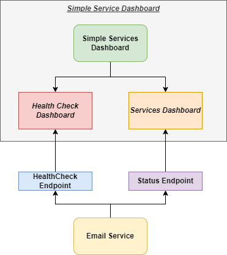

# Simple Services Dashboard

Simple service to provide the ability to monitor other services check their statuses. Basically it provided a Health Check
dashboard for them. Services can be configured in the configuration by adding a new one. Because all the services will use same concepts and
URL routes to monitor and get details about the service.

## Introduction

Currently the service can monitor the next applications:

* *Email Service* - simple service to send the emails with different providers and with templates support (the service old and maybe later will be updated as well).

All of them use the service template with the status endpoint and health checks. So in case new serviced will be development by using this
solution it can be added here to monitor.

Details about the service:
* [Service usage]() - how to use the service and how it works
* [Services Configuration to monitor](docs/ServicesConfiguration.md) - how to edit configuration for monitored services
* [Add the new service support](docs/AddNewService.md) - how to add the new service

## Git Repository

Service code: https://github.com/Digiman/simple-services-dashboard

## Tech Stack

Application developed and used next technologies (on the backend) and components:

* .NET 6 (LTS)
* Serilog for logging
* Swashbuckle for Swagger (OpenAPI)
* HealthCheck UI for ASP.NET Core

## Infrastructure

TBD

## Build and Deploy (CI/CD)

No any configuration available at least for now.

TBD

## Logging

Service/web application use Serilog to write and generate structure logs with details how application working. It's possible to configure logs to send to the different services like Splunk to monitor in one single place or use other tools to read he logs. Depending on hosting type and where the service wil be placed.

## Monitoring

No any monitoring tools are available in teh service at this time.

TDB

## Environments

TBD

## Availability and Health check

TDB

## Build Process for Local Development

* You have Docker installed - ideally latest version of the tool.
* You have .NET 6 installed (SDK and runtime).
* Visual Studio or JetBrains Rider or Visual Studio Code as IDE - one of them, better for you, all them is appropriate.

Optionally:
* [Tye](https://github.com/dotnet/tye) - Project Tye for local development and helper for containers and Kubernetes.

