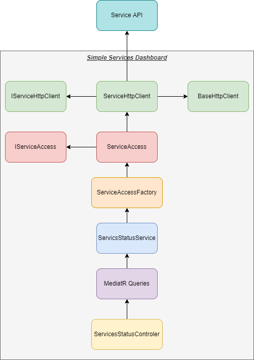

# Add the new service support

## Introduction

The service provided the way to monitor the services statuses as well as their health checks.

The 2 main things to use here:
1. Health checks - to get status of all service dependencies that we able to monitor.
2. Status endpoint - to get the service version and other details.

## How to add the new service to monitor

Steps to do to add a new service to monitor:
1. Update the configuration by adding new service details - see here [Services Configuration to monitor](ServicesConfiguration.md)
2. Create a new classes for the application
    * create service client
    * create service access
    * update service access factory by adding the new service config and service code
    * update the service to get the details from the services - ServicesStatusService

The image bellow provided some details in visual way.

After this we can see the changes and start the application to see how it works. The application will show the changes in Health Check - new
services need to be added in the list. Also on Dashboard we can see the new line with the service.

