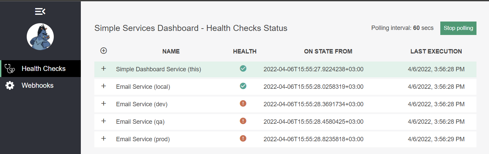
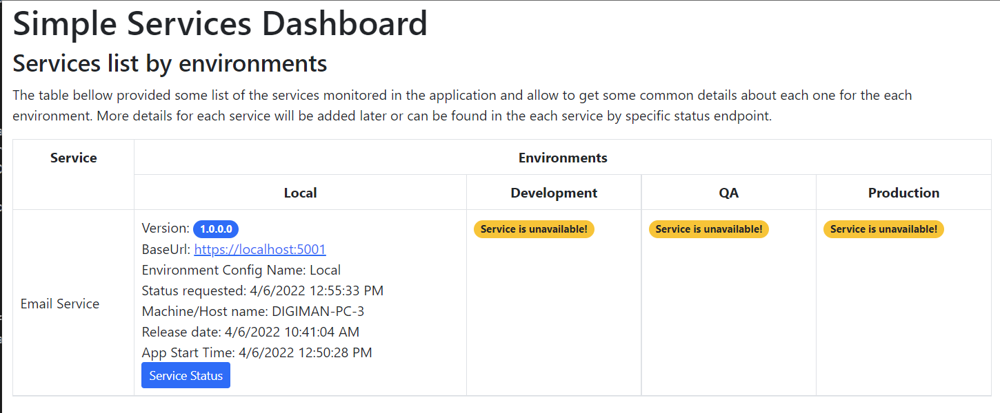
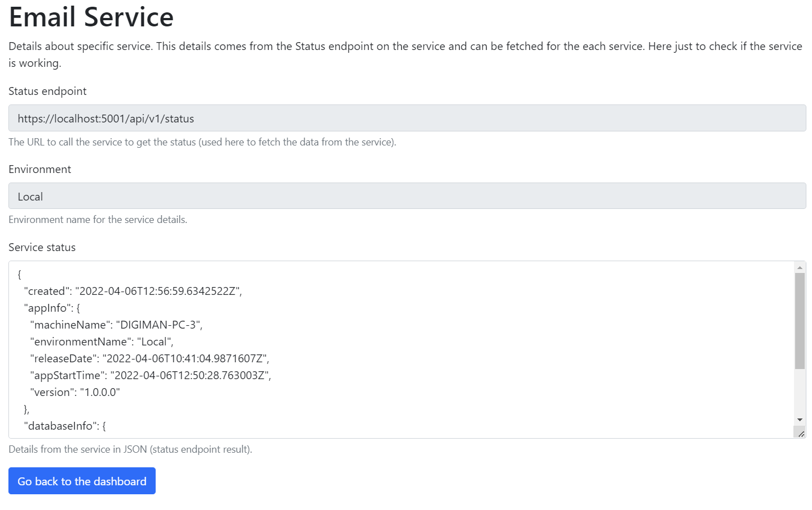

# Service usage

Here provided very simple information how service works and functionality provided.

## Introduction

The service provided 2 main views and information about the application monitored:

1. Health check dashboard - based on the Health checks of the each service.
2. Dashboard with simple table with short details about the service.

Next sections provided details and sample views.

## 1 Health check dashboards

On the next images provided sample statuses for the application configured.

## 2 Services dashboard

The services dashboard provided simple information about the services.

### Service details

Simple page with the details for each service (for service code, environment) - it read the status endpoint on the service and provided result as JSON with data.

